# Flutter project

[1. Quiz app](#1.-Quiz-app)

[2. Personal Expense app](#2.-Personal-Expense-app)

[3. Meals app](#3.-Meals-app)

[4. Shop app](#4.-Shop-app)

[5. Great Place app](#5.-Great-Place-app)

[6. Chat app](#6.-Chat-app)

## 1. Quiz app

### 1-1. Screen shot

  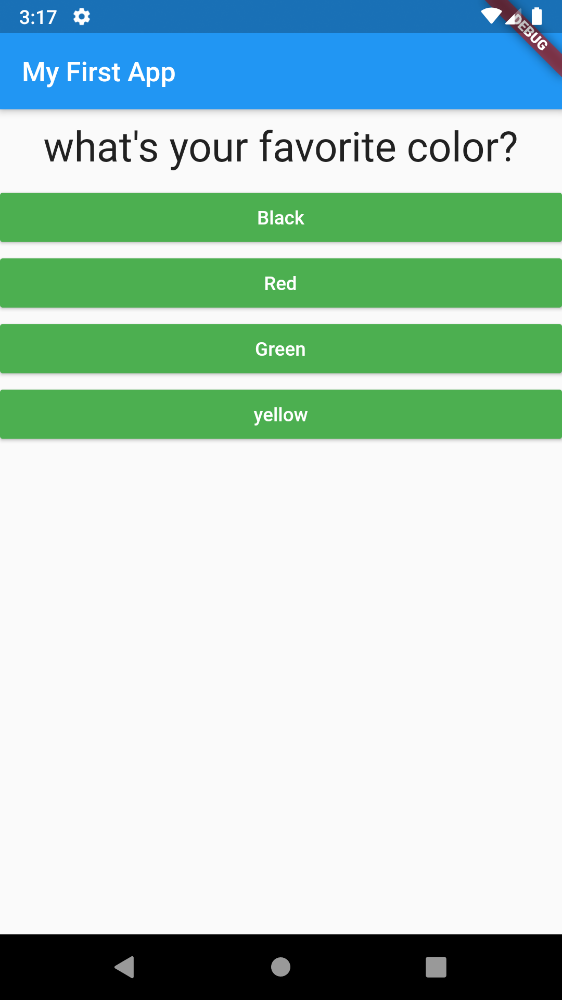
  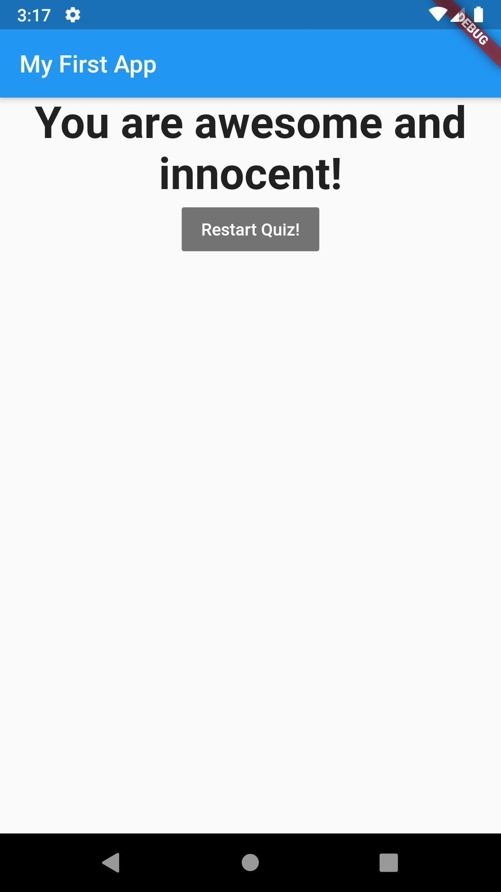 

### 1-2. Description
- 정해진 퀴즈를 풀고, 그에 따른 결과(score)를 보여주는 앱
- main.dart는 stful위젯, setState함수 정의, 퀴즈 리스트, 스코어를 가지고 있음.
- 그리고 이러한 함수, 퀴즈들은 index의 크기에 따라 Quiz, Result 위젯을 띄움.
- Quiz는 퀴즈리스트, 현재인덱스, 답선택함수를 받는다. 
  - Question은 현재 퀴즈인덱스의 질문 텍스를 받는다.
  -  Answer 는 현재 퀴즈인덱스의 답변리스트와 답선택함수를 받는다.
- Result는 스코어와 리셋함수를 받는다. 

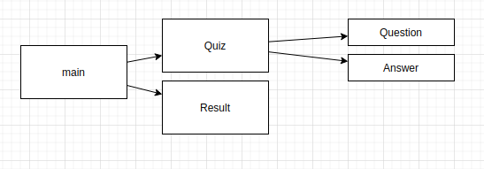

### 1-3. Learn
- Dart, flutter Basic (문법, stful, stless..)
  
    
## 2. Personal Expense app

### 2-1. Screen shot

  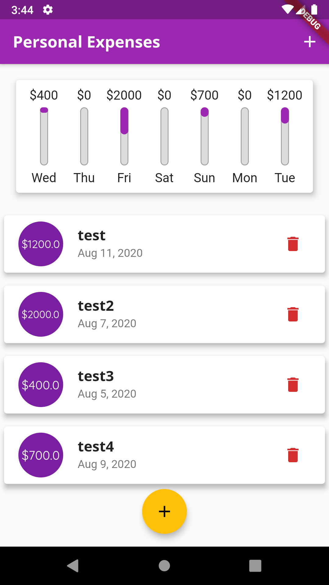
  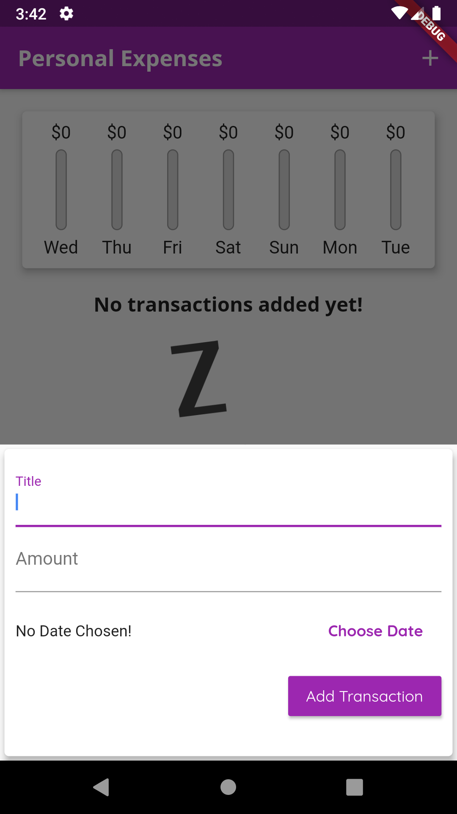 
  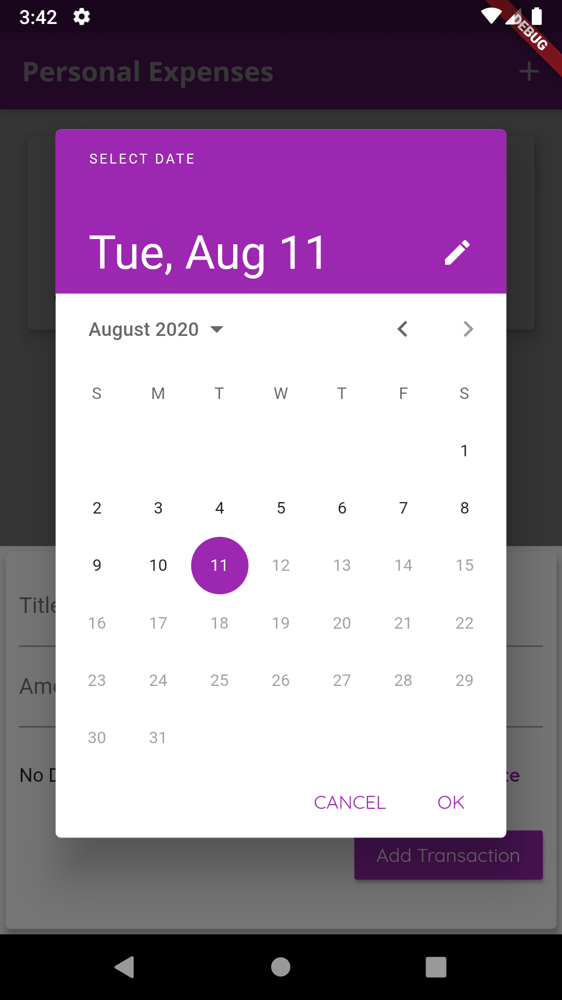 

### 2-2. Description
- 가계부 앱
- main.dart에 userTranscation리스트가 있고, 이걸로 지출 리스트를 만든다. 
  퀴즈앱과 마찬가지로 모든 함수, 변수가 MyhomePage클래스에 정의되어 관련 위짓으로 넘겨주고 있다. 
- 최근 7일의 지출리스트를 Chart 위짓에 보내고, CharBar와 함께 차트를 만든다. 
- 지출리스트와 지출내역삭제함수를 TransactionList 위짓에 보내고, ListView를 만든다. 
- 앱바와 하단 float버튼을 클릭하면, ModalBottomSheet함수가 실행된다. 지출내역추가함수를 NewTransaction에 보내고, 입력창을 만든다.

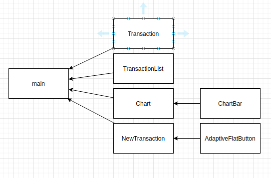 

### 1-3. Learn
- 함수를 만드는 방법, 메소드 이용방법
- 스타일링
- for, if등의 다트 문법

## 3. Meals app

### 3-1. Screen shot

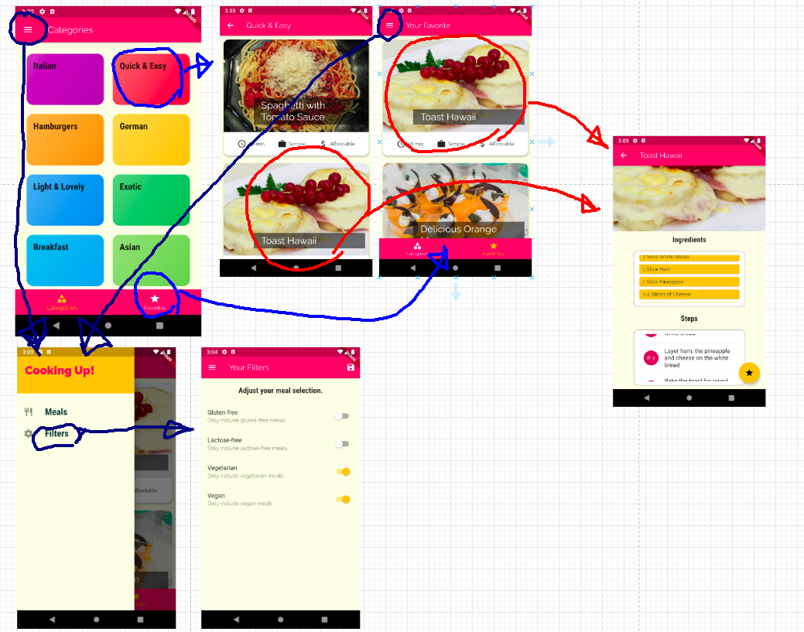

### 3-2. Description

- MyApp에 필터링, favorite추가 등의 함수와 필터링된 meals리스트, favorite meals가 정의되어있음. 
  그 함수와 그렇게 만들어진 meal리스트를 각 screen에 Navigation을 통해 전달을 한다. 
- 기본 뷰는 TabScreen이다. 바닥에 네비바로 전체 카테고리 또는 좋아요한 meals 리스트로 이동할 수 있다. 
- 전체 카테고리는 더미 데이터를 받아서 쓰고, 카테고리 아이템을 따로 만들어서 그리드를 완성한다. 
  특정 카테고리를 누르면, 해당 카테고리에 속하는 meals 리스트가 나온다. 
- 리스트 중 하나를 클릭하면, 디테일페이지로 이동하고 거기서 좋아요를 할 수 있다. 
- Drawer에서는 필터링을 설정할 수 있다. 

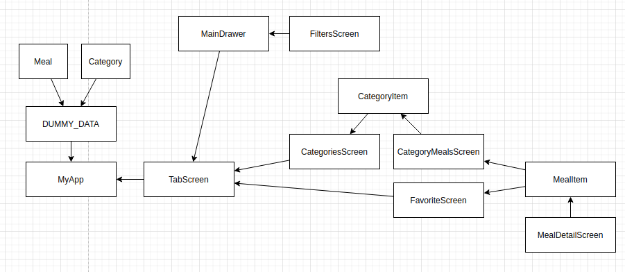

### 3.3 Learn

여러 스크린이 있는 앱에서 Navigation을 어떻게 하는지. 각 스크린에 변수를 넘겨주는 방법.

## 4. Shop app

### 4-1. Screen shot

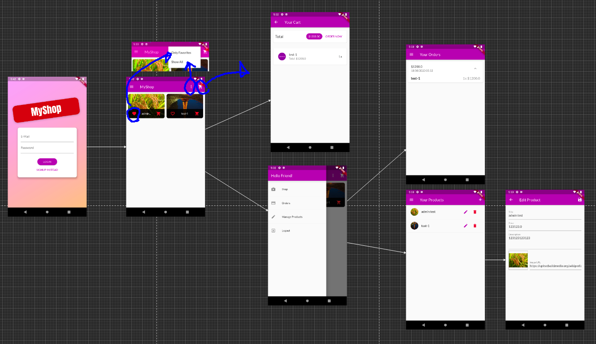

### 4-2. Description

firebase - authentication 기능을 통한 유저관리.
firebase - database 기능을 통한 데이스 관리.
provider를 통한 상태관리.

기본적인 쇼핑앱의 기능을 구현함. 

- 제품 오버뷰 (좋아요 기능)
- 카트에 담기
- 주문하기
- 제품 등록 및 수정 기능

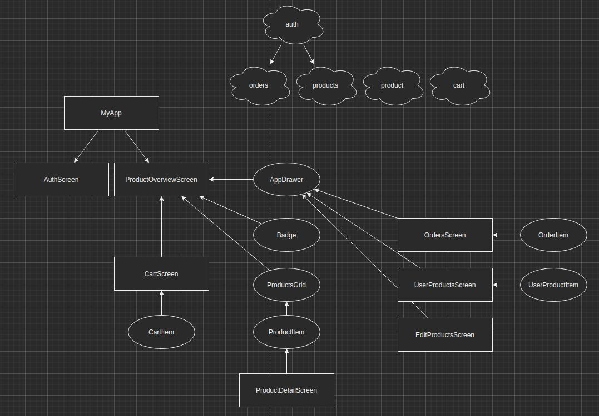

### 4-3. Learn

- firebase 연동하기
- http 요청 보내기
- provider를 통한 상태관리
- 애니메이션

## 5. Great Place app

### 5-1. Screen shot

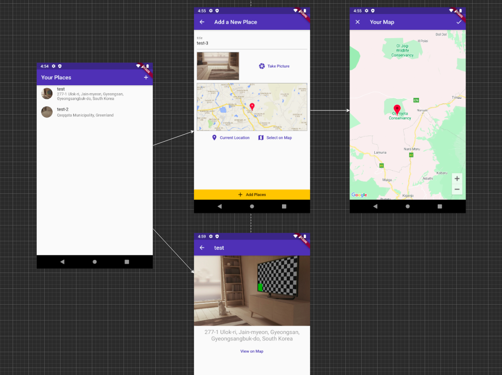

### 5-3. Description

- 메인화면에 place리스트가 있다. 
- 새로 만들기 화면에서는 제목, 사진, 장소를 받는다. 
  - 장소는 구글 api를 이용
- 만들어진 리스트를 클릭하면 해당 스크린을 볼 수 있고, 지도도 볼 수 있다. 
- sqlite를 통해 로컬환경에 정보를 저장하였다.

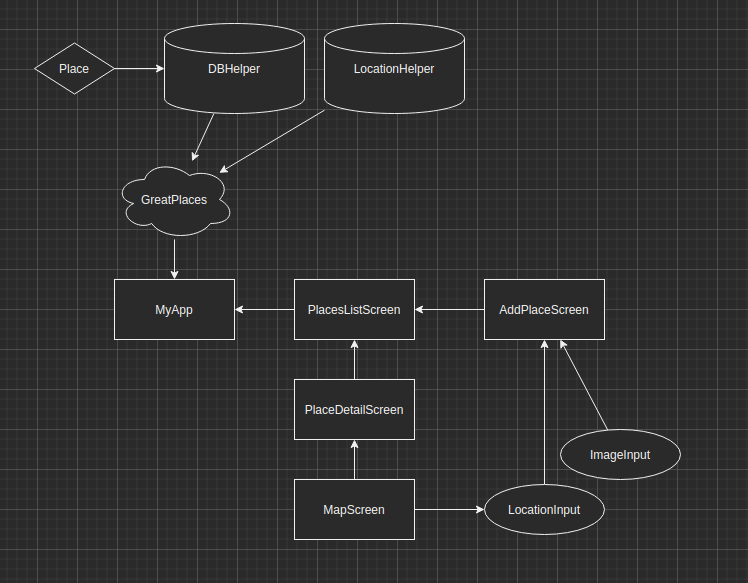

### 5-3. Learn

디바이스 기능을 이용하는 방법

- 카메라, 위치정보를 해당 플러그인을 받아서 사용.
- sqlite로 로컬 환경에 저장해서 상태유지

## 6. Chat app