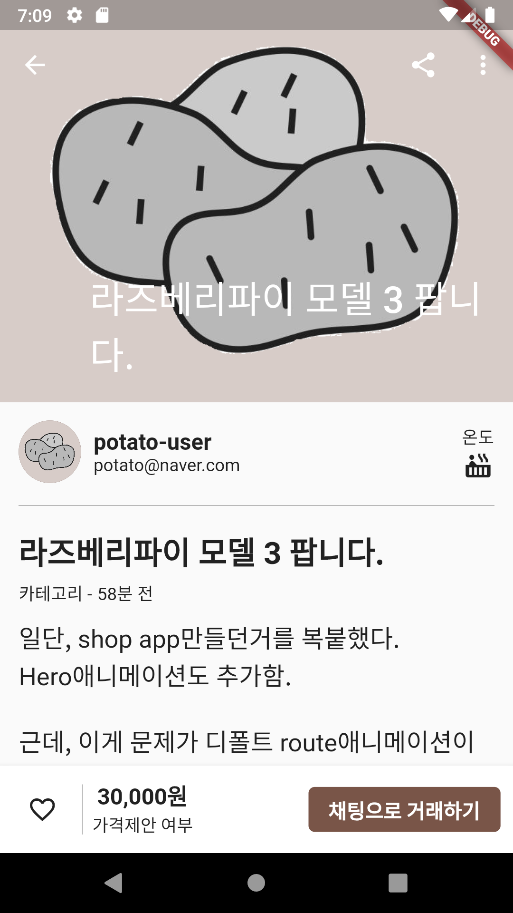

# 감자마켓

앱 개발 기록

## 08.26 ~ 09.03

> 이때는 기록을 거의 못 남겼다.

**multi_image_picker**

이거 쓸라면 `AndroidManifest.xml ` 파일에 권한을 추가해야한다.

**ListTile의 한계**

ListTile은 딱 정해져 있다. leading, title, subtitle, trailing...
그래서 단순하게 만들기에는 유용하지만,  
그래서 더 많은 정보를 넣고 하고 싶을때는 부적합 하다. 

그런 나를 위해 대안이 [여기에](https://api.flutter.dev/flutter/material/ListTile-class.html) 잘 설명이 되어있다. 

**GestureDetector**

그냥 만들면, 내부 위젯만 터치를 인식한다. 비어있는 부분은 눌러도 인식안됨.
그럴때, 
`behavior: HitTestBehavior.opaque` 를 추가한다. 

그럼, 해당 위젯 크기 전체가 인식됨. 

`HitTestBehavior.translucent` 는 터치인식이 오면 아래 위젯으로 내려감. 
그리고, 혹시나 아래에 같은 제스처가 있으면 하나만 인식이 됨. 

근데 이건 언제쓰는지 모르겠다. 

저 두개의 차이가 이해가 안되서 찾아보니, 나 같은 사람이 역시나 있다. 
[해당 이슈](https://github.com/flutter/flutter/issues/18450)  

**await void**

이미지를 선택하면, `List<Asset>` 이 만들어진다. 

이걸 firebase스토리지에 하나하나 넣어주는 걸 `forEach`로 처리하려고 했다.
근데 생각처럼 잘 안되었다. 

forEach에 적용시키는 함수가 async일 경우에는 forEach과정을 기다리지 않고, 다음 코드인 return 함수가 실행되어 버린다. 
그렇다고 forEach부분을 await할 수는 없다. 

리턴값이 없는 작업은 기다릴 수가 없다고 한다. 
[관련이슈](https://github.com/dart-lang/sdk/issues/28305)
[스택오버플로 답변](https://stackoverflow.com/questions/58939437/return-type-of-void-async-function-in-dart)

그럼 forEach에서 async를 쓸려면 어떻게 해야할까.

[나랑 정확하게 같은 상황에 대한 멋진 답변](https://stackoverflow.com/questions/51106934/my-async-call-is-returning-before-list-is-populated-in-foreach-loop)

forEach 대신 for를 쓰면 된다.

**탭을 옮겨다니면 rebuild가 계속된다.** 

그럴 필요가 없는데.. 
그래서 IndextStack으로 상태가 저장되도록 했다. 

그리고 새로 제품을 올리면 다시 빌드를 하고 싶다. 
그래서 다시 provider를 넣었다.. 어제는 필요없다고 지웠는데,  오늘은 다시 넣고 있네..

**Duration**

```dart
Duration(days: 1)
// 24:00:00.000000
// 시:분:초.밀리초
```

**스택으로 바꿈**

리스트 부분을 스택으로 바꿔서 넘치는 걸 방지했다. 
그리고 이렇게해야, 나중에 좋아요, 채팅을 넣을 수 있다. 마음에 들어~

**날짜와 가격**

별거 아닌 거 같은데, 오래걸렸다. 머리도 많이 굴렸음. 
원하는 대로 나오긴 하는데, 알고리즘이 마음에 들지는 않는다. 

설명하자면, 날짜는 초, 분, 시간, 개월, 년으로 변환해서 나오도록 했다. 
당근마켓은 '어제', '그저께' 뭐 그런것도 쓰던데, 나는 그렇게 안하고, 유튜브 댓글처럼 만들었다. 

가격도 콤마를 넣고, 10만원 이상은 글자를 넣어주었다. 
이게 별거 아닌 것 같은데, 마음처럼 안나와서 고생했다. 

지금은 일단, 이대로 쓸만하지만, 코드가 알아보기 힘들정도로 더러우니.. 
깔끔하게 정리하는 과정이 언젠가는 꼭 필요하다.

<p float='left'>
    
     => 
    
</p>


## 09.04

**폼 위젯을 분리하고, 외부파일에서 validate, save를 해야한다.**

GlobalKey<FormState> 변수를 form위젯에 정의하지 말고, 
외부파일에 정의한다음, 폼이 있는 파일로 인자로 넘겨주면 된다.

그럼 외부파일에서 formkey.currentState.save() 를 부를 수 있다.

> 관련 [스택오버플로 답변](https://stackoverflow.com/questions/57721371/how-to-call-stateful-widgethave-form-method-from-another-dart-file-flutter) 
> 답변에 보면 super를 쓰는데, 난 저렇게 안해도 되던데? 저게 하는게 뭔지를 잘 모르겠다.


**업로드 상태를 보여주기**

- 방법 1. 스낵바

```dart
Scaffold.of(context).showSnackBar(
    SnackBar(
        content: Text('업로드 중...'),
    ),
); 
// 같은 Scaffold안에서는 이게 안된다. 
// Builder로 감싸서 하면, 가능.
Builder(
    builder: (context) => //..
)
```

만들고 보니, 마음에 안든다. 

- 방법 2. 화면 전체에 돌아가는 거 

[modal progress hud라고 다운 받았다.](https://pub.dev/packages/modal_progress_hud) 버전이 1을 넘는게 없구만..
암튼 사용법도 간단해서 이걸로 하기로 함. 
이 방법이 좋은게, 방법1은 바깥 함수에서 어떻게 부를지 머리 아팠는데. 근데, 이건 따로 `inAsyncCall` 인자가 있어서 간단하게 만들 수 있음.


**키보드 사라지게 하기**

`FocusScope.of(context).unfocus()`
`.of`라서 외부에서도 부를 수 있다. 

가격을 받을 때는 숫자만 들어오게 해야한다. 
문자를 아예 입력못하게 하는 방법이 있다. 

```dart
inputFormatters: <TextInputFormatter>[
    FilteringTextInputFormatter.digitsOnly
], // 이걸 폼필드에 넣어주면 된다.
```

그리고 받은 값은 언제나 `String`타입이다.
저렇게 해서 숫자만 받는다고 해도, 타입은 문자이다. 
validator, onSaved가 받는 인자도 모두 String이다.  


**사진이 없을때는 디폴트 사진을 넣어주기**

디폴트 사진으로는 감자 그림을 넣었다. 
이걸 먼저 스토리지에 올린다음, `DBHelper`에 디폴트 사진 url을 받는 메서드를 추가했다.

그리고 assets이 `null`일때,( `isEmpty`가 아니라, `null`이다.)
암튼 선택한 사진이 없을때, 저 사진을 받아서 쓰도록 했다. 


**사진 용량 줄이기**

```dart
ByteData byteData = await image.getByteData(quality: 50); // 퀄리티를 조절하면 된다. 디폴트 100
List<int> imageData = byteData.buffer.asUint8List();
final photoRef = ref.child(DateTime.now().toString() + '.jpg');
final finRef = await photoRef.putData(imageData).onComplete;
```


**db에 대한 고민**

product클래스에 id필드를 새로 만들어야겠다. 
find를 해야하는데, 할만한 필드가 없다. 

uuid 모듈을 받아서 랜덤 id를 만들었다.

> 이걸 하면서, 다시보니 users 콜렉션이 있는데, 이거랑 products랑 같은 관계니까. 
> products문서에 유저의 id를 저장하는 특별한 필드를 써야하는게 아닌가.. 하는 생각을 했다. 
>
> 근데 그렇게 만들려면 또 users콜렉션으로 요청을 보내야하고 그건 별론거 같아서 그냥 String으로 저장하기로 함.

아, 스토리지 디렉토리도 뭔가 마음에 안드는데..


**디테일 뷰 고치기**

일단, shop app만들던거를 복붙했다. 
Hero애니메이션도 추가함. 

근데, 이게 문제가 디폴트 route애니메이션이랑 겹치면서 이상하게 보임.
이건 내일 해야지~


## 09.05

**판매자 정보**

판매자 정보를 가져오기 위해서 일단 **유저 모델을 만들고**, **db에서 불러와 모델형태로 가져오는 메소드를 추가**했다. 
근데 클래스명을 `User`로 하니까, 이게 예약된 클래스인지 안되서, `Profile`로 바꿨다.

이건 굳이 provider를 안써도 될 것 같아서, dbhelper에서 바로 가져오기로 했다. 
FutureBuilder로  가져와서 넣었다.

그리고 `ListTile`로 판매자 정보를 보여줄려고 했는데, 이게 디폴트 패딩이 있는지, 마음에 안들어서 Row로 만들기로 했다. 

**좋아요 기능**

디테일 페이지에서 핵심되는 기능이다.

**색깔**

나중에 또 이런 앱을 만들때는 처음에 계획을 잘 세우자.
색깔이나, 데이터베이스 모델 등등 구조를 좀 잘 세웠으면 함.

왜냐하면 지금너무 삽질하고 있어서.. 

**BottomAppBar**

바닥에 가격하고 채팅하기 위젯이 고정되어있어야 한다. 
그래서 난 이걸 `Positioned`로 넣어야하나.. 했는데.

이걸 위한 위젯이 따로 있다. 
바로, `BottomAppBar`
플러터는 알면 알수록 대단..

**IconButton vs InkWell**

아이콘 버튼은 디폴트 크기가 있다. 그래서 이걸 바꿔줄려면 SizedBox로 감싸던가 해야하는데, 
InkWell은 그런거 안해도 된다. 

[스택오버플로](https://stackoverflow.com/questions/49211024/how-to-resize-height-and-width-of-an-iconbutton-in-flutter)

**머티어리얼 디자인**
[https://material.io/develop/flutter/components/app-bars-bottom](https://material.io/develop/flutter/components/app-bars-bottom)
여기 자주 들어가서 참고하면 좋을 듯.

**디테일 페이지 레이아웃**

일단, 오늘 레이아웃은 그럴듯하게 만들었다. 
아직, DB에 부족한게 많다. 유저정보나 물건 정보 관련해서..

그리고 앱바 부분에 제목을 보여주는 기능이랑, 
사진 넘기는 것도 못했다. 

유저 페이지나 채팅, 좋아요 기능 등등.. 아직은 정말 그냥 디자인만 따라했다. 
저 앱바 사진부분은 근데 어떻게 해야될지 모르겠네.. 가능한 건지도 모르겠고.



## 09.06 ~ 09.07

**앱바 제목 보이기**

앱바의 타이틀이 스크롤을 제목을 가릴정도로 내렸을때 보여주고 싶었다. 

그렇게 할려면, 스크롤에 대한 값을 알아내야한다.
[미디엄 포스팅](https://medium.com/@diegoveloper/flutter-lets-know-the-scrollcontroller-and-scrollnotification-652b2685a4ac)을 참고해서 만들었다.

제목의 위치는 모든 제품이 동일하니까 0~ 380까지는 null 로 안보이다가, 
그 이후로 스크롤하여 제목이 가려질때 앱바에 제목이 뜨도록 했다. 

```dart
  final ScrollController _scrollController = ScrollController();
  bool title = false;

  void initState() {
    super.initState();
    _scrollController.addListener(() {
      if (_scrollController.offset > 380) {
        setState(() {
          title = true;
        });
      } else {
        setState(() {
          title = false;
        });
      }
    });
  }

  @override
  void dispose() {
    super.dispose();
    _scrollController.dispose();
  }
```

380으로 그냥 주는건 잘못된거다. 
다른 기기에서 테스트는 해봐야 겠지만, 

일단 원하는대로 구현은 되서 기쁘다.

**사진목록 넘기기**

사진을 한장한장 넘기는 기능을 넣어야했다. 
이걸 Carousel 케러셀이라고 한다. 회전목마라는 뜻.

암튼 이걸 위한 패키지를 받았다. 
그리고 Hero에 child로 넣어주었다. 
Stack으로 몇번째 사진인지 보여주는 기능도 넣었다. 

다행히 잘 작동했다. 

사진 비율을 맞추는 것이 힘들었는데, 옵션의 인자를 조정하다보니 어쩌다 맞춰졌다.

디테일 페이지를 만든다고, 여러모로 새로운 것도 많이 찾아보고 배울 수 있었다.
진짜 당근마켓의 그런 기능들을 하나하나 채워나가는 것이 뿌듯하다.

**계획**

채팅기능은 정말 마지막에 넣기로 했다. 
일단 지금은 만들고 리스트 업데이트하고, 프로필 보이고 검색, 좋아요 등등 세부적인 것을 완전하게 만드는 것이 집중.

채팅기능도 정말 그냥 기능이기때문에, 
일단 지금하는게 정리가 좀 되야될 것 같다. 

너무 기능을 추가추가.. 하다보니, 전체적인 구조를 너무 신경 못쓴 것 같다.

오늘은 아무것도 못했네... 너무 계획없이 즉흥적으로 만들기만 하니까 결국 이렇게 되는 것 같다. 

## 09.08 ~ 09.10

**다운스크롤시 리스트 추가**

리스트를 내리면, 아래에 내용이 자동으로 추가가 된다. 
이 기능을 넣으려면, 리스트의 바닥이 얼마나 남았는지를 파악하고, 
바닥과 일정거리 미만으로 가까워지면 요소를 더하는 과정이 필요하다. 

리스트의 위치는 controller인자와 리스너로 구현을 할 수 있었다. 
디테일 뷰에서도 비슷한 구현을 해서 이건 별거아니었는데, 문제는 그 다음이었다. 

이게 일정거리 미만이면 함수가 실행되니, 여러번 실행이 되면, 같은 내용이 계속 리스트에 추가되었다. 
왜 이런 문제가 생기는지 파악하는 것에 오래걸렸다. 

처음에는 마지막 date의 상태를 저장하여 같은 요청이 오면 거절하는 방식으로 하려 했으나, 생각처럼 되지않고, 
일단 DB에서 불러온 요소의 마지막과 기존리스트의 마지막 요소가 같은지를 확인하는 방식으로 일단 만들었다. 

100% 마음에 드는 방법은 아니다. 
난, 아예 DB로 요청을 안보내고 싶었는데, 당장 해결부터 하려고 했더니 이렇게 밖에 못했다.

오늘은 별거 못했네..

**앱바에 바텀탭 추가하기**

앱바의 높이나 텍스트 크기는 나중에 ThemeData에서 한번에 관리할 수 있게 해야할 듯. 
테블릿이나 특정 기기에 따라 다르게 나올 수 있도록..

**라우팅 에니메이션**

리스트에서 디테일로 넘어갈때 디폴트 에니를 없애고 싶었다.
[스택오버플로](https://stackoverflow.com/questions/56792479/flutter-animate-transition-to-named-route) 를 참고했다. 

근데 onGenerate 보다는 ThemeData에 추가하는 방식이 깔끔해보여서 
shop app에서 한거를 복붙해서 만들었다.

**디테일뷰 나누기**

사진이 나오는 앱바랑, 판매자 부분을 분리하기로 했다. 
근데 앱바 나눌때 부터 계속 List\<dynamic> .. 에러가 나서 겨우 해결.

```dart
map((){}).toList() // 이거를
map<Widget>((){}).toList() // 이렇게 해야 List<Widget>으로 인식한다. 다트는 진짜..
```

**나의 당근 화면 만들기**

일단, DB 를 나눴다. profiles, userProducts.

```markdown
# profiles: id=user.uid
- name
- email
- image
- temperature
```

```markdown
# userProducts: id=user.uid
- sellProducts
- buyProducts
- likeProducts
```

유저정보도 프로바이더에 저장하는 것이 좋을 것 같아서 수정중이다. 

근데 좋아요 기능같은 이미 있는 문서를 특정 문서(유저)와 연결시킨다는 것은 꽤나 머리아픈 일이었다. 
왜냐하면 여러 방법이 있기 때문이고, 잘 못하면 중복되어 저장되거나 연결상태가 엉킬 수 있기 때문이다. 

가장 간단한 방법은 따로 콜렉션을 만들어서 거기에 좋아요한 아이템문서를 중복해서 저장하는 방법이지만 당연히 별로고.
내 생각에는 좋아요한 문서의 아이디를 유저문서에 저장하는 것이 좋다고 생각했다. 

하지만 이 방법도 문제가 유저문서가 너무 커질 수 있다는 것이다. 
아무리 아이디만 저장한다지만, 좋아요, 판 물건, 산 물건 아이디를 다 저장하고 있는 것은 뭔가 아름답지 못했다. 
cloud firestore는 문서에서 설명하듯, 가벼운 문서를 여러개 저장하는 것에 특화되어 있다고 하니, 문서를 나누는 것이 좋은 방법이다.

그래서 물건의 id를 저장하고 있는 저 3개를 분리해서 따로 콜렉션을 생성. 유저와 연결하는 방법을 선택했다. 
처음에는 3개를 한 문서에 저장하려고 했는데, 그럼 별 의미가 없는 것 같아서, 
그냥 아예 유저 문서에 3개의 콜렉션을 만들고, 문서에 id하나를 넣는 방식으로 만들기로 했다. 

[공식문서의 예시를 보자](https://firebase.google.com/docs/firestore/data-model?authuser=0#subcollections)

> 내가 잘못한게 다른문서를 참조해서 id를 저장할때 그걸위한 데이터형이 있다. 
> 그걸 써야함. 그냥 String으로 저장하지말고, 경로를 줘야함. 

## 09.11

**DB의 설계의 중요성**

데이터 베이스를 다루는 것에 문제가 많음을 느끼고, 잠시 개발은 멈추고 데이터 구조를 다시 만들기로 했다.

cloud firestore 유튜브 영상을 보고, 문서도 읽어봤다.
많은 기능을 배웠다. 
지금의 DB보다 훨씬 나은 형태를 만들 수 있겠다는 생각이 들었다.

```
처음에는 DB에는 중복되는 정보의 저장은 안하는 것이 무조건 좋다고 생각했다.
하지만, 꼭 그런 것만은 아니었다. 
필요한 정보를 모으기 위해 여러 콜렉션을 떠도는 것보단, 차라리 한 문서에 다 정리하는 것도 방법이더라.
이걸 denormalize 방식이라고 하는데, 괜찮은듯.

여기서 문제가 여기저기 뿌려둔 데이터의 sync를 맞추는 것.
그것도 firebase function 기능을 이용하면 가능하다. 

이 function 함수기능은 쿼리자체를 맡겨도 될 정도로 유용한 녀석이다. 
아직은 안써봤지만, 이걸 적극 활용할 예정이다.
예를 들어 
- 오래된 게시물을 삭제, 오래된 유저를 비활성화, 
- 한 문서의 수정을 감지하고, 중복된 다른 문서도 수정
- 좋아요 카운터 등등..
- 보안을 위해 아예 query요청자체를 하나의 api로 만들어서 그걸 쓰게 한다거나.
```

> 이 밖에도 트렌젝션, 샤딩, 등의 기능이 많다. 
> 모든 필드가 인덱스에 자동등록이라니;; 망고디비를 쓰던 내겐 충격..

DB를 공부하다보니, 좋은 앱을 만든다는 것은 좋은 DB를 짜는 것이 80프로는 먹고 가는 것 같다. 
저장하는 것 뿐만 아니라, 어떻게 쿼리를 수행할 것인지.. 그것이 앱 성능을 좌우하니까.

그래서 한동안 firebase를 공부하면서 DB구조를 설계할 예정이다.

**모든 스크린**

```
로그인/회원가입
제품리스트
- 제품디테일
포스팅리스트
- 포스팅디테일
채팅리스트
- 채팅디테일
프로필
마이페이지

```


> - **로그인/회원가입**
>
>   - profile
>
>   > [dbhelper]
>   >
>   > // 계정생성
>   >
>   > // 계정가져오기
>   >
>   > // 
>   >
>   > addProfile()
>   > findById()
>
> - **제품 리스트 뷰**
>
>   - product
>
>   > 리프레쉬:
>   > 최신 20개 provider에 덮어쓰기
>   >
>   > 다운스크롤:
>   > 다음 20개 추가하기
>
> - **제품 디테일 뷰**
>
>   - profile
>   - profile.sellproduct
>
>   > 좋아요 기능: 
>   > 유저 문서의 서브콜렉션으로 문서 아이디를 저장. 
>   > 좋아요를 누르면, 새로 문서를 생성하고, 유저 계정에 카운터 필드 업데이트, 제품의 카운터 업데이트.
>   > 좋아요 여부를 판단할때는 현재계정 문서의 좋아요 서브 콜렉션을 검색하면 됨.
>   > 좋아요를 해제할때도 그냥 문서를 삭제하고, 카운터를 업데이트하면 됨.
>   >
>   > 판매자의 다른 상품: 
>   > 유저에 판매상품 콜렉션에 product문서가 그대로 저장되어있음.
>   > 그걸 그대로 보여줌.
>   >
>   > 채팅 연결: 
>   > 채팅 방 생성
>
> - **동네생활 리스트 뷰**
>
>   - post
>
>   > 리프레쉬: 10개 덮어쓰기
>   >
>   > 다운스크롤: 10개 추가하기
>
> - **동네생활 게시물 뷰**
>
>   - post.comment
>
>   > 댓글 최신순, 등록순 정렬
>   >
>   > 댓글 쓰기, 댓글 아래로 더 보기(자동)
>   > 답글 쓰기, 답글 위로 더 보기(수동)
>
> - 채팅 리스트 뷰
>
>   - chat
>   - 채팅 룸, 상대방, 가장최신메시지, 물건썸네일
>
>   > 
>
> - 채팅 디테일 뷰
>
>   - 모든 메세지 내용
>
> - 프로필 뷰
>
>   - 판매상품개수
>   - 매너평가
>   - 온도
>   - 리뷰 탑3, 
>
> - 프로필 뷰 - 판매상품보기 뷰
>
>   - 전체, 판매중, 거래완료
>
> - 프로필 뷰 - 거래 후기 뷰
>
>   - 전체, 구매자 후기, 판매자 후기
>
> - 마이페이지 뷰
>
>   - 내 정보
>
> - 마이페이지 - 판매내역 뷰
>
>   - 판매중, 거래완료 탭
>
>   > 제품 수정 페이지
>   >
>   > 글쓰기 뷰랑 같음.
>   > 
>
> - 마이페이지 - 구매내역 뷰
>
>   - 구매내역
>
> - 마이페이지 - 관심목록 뷰
>
>   - 중고거래, 
>
> - ///////////////
>
> - 글쓰기 뷰
>
> - 검색 뷰
>
> - 거래완료, 선택, 리뷰 남기기 뷰
>
> - 기타 잡다한 설정 뷰

**리스트뷰**

- 제목
- 가격// 글자가격은 클라 측에서 변환하기
- 썸네일
- 생성날짜
- 카테고리
- 지역
- 좋아요 수
- 채팅 수
- 끌올 여부

```
제목, 가격, 썸네일, 생성날짜, 카테고리, 지역, 좋아요수, 채팅수, 끌올여부: 9개
```

**디테일뷰**

- 설명
- 이미지들
- 판매자 이름, 사진, 지역, 온도, 판매상품
- 조회수

```
이미지들, 설명, 판매자 정보, 조회수
```

**채팅 모아보기**

- 제품 이미지
- 

```

```

**채팅 룸**

- 제품 정보
- 메시지

**마이 페이지**

**마이페이지-판매내역**

- 내가 판 제품

**마이페이지-구매내역**

- 내가 산 제품

**마이페이지-관심목록**

- 좋아요한 제품