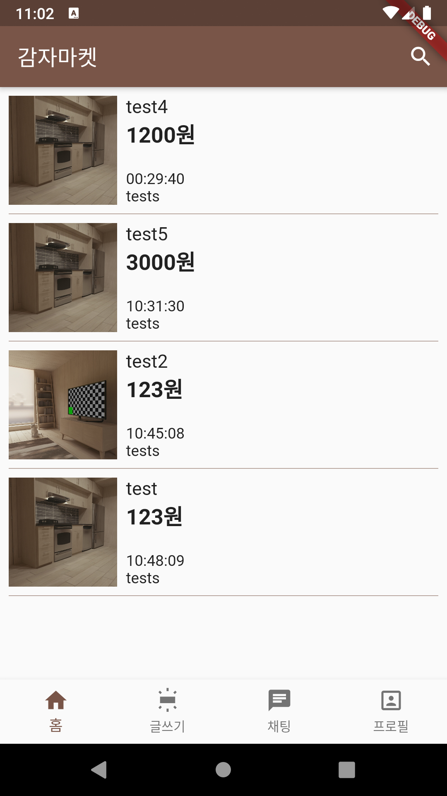
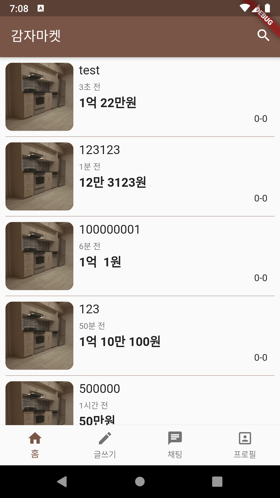

# 감자마켓

## 진행

- 마켓스크린
  
  ```
  마켓 스크린에서 필요한 것은 products 리스트이다. 
  따라서, 해당 리스트를 제공받아야하고, 필요에 따라 다시 요청을 보낼 수 있어야한다.
  ```
  
  - 당겨서 업데이트
  - 제품사진 없을때 디폴트 사진넣기
  - 스크롤 끝에 오기전에 로딩해서 쭉 연속으로 스크롤 되도록.
    - 처음에 다큐먼트 전체에서 상위 20개만 가져오고, 나머지는 내릴때마다 가져오도록..
  - 검색기능
  - 홈 탭을 누르면 홈이 안보임..
  - 
  
- 글쓰기 스크린
  
  - 뭐하나 안넣으면 경고 팝업 띄우기
  - 사진 용량 조절
  - 사진 업로드 하고 url받아오는거 좀더 빠르게 안될까.. 너무 오래걸림.
  - 사진 순서바꾸기
  
- 제품 디테일화면
  - 내가 판매자인 제품은 다르게 보이도록
  
  - 좋아요 기능
  
    ------------
  
- 프로필 화면
  - 내 프로필은 수정 버튼
  - 판매중, 판매완료 상품 화면
  
- 채팅으로 거래하기
  
  - 디테일페이지에 채팅버튼

***

### Firebase 연결

1. 프로젝트 이름설정
2. 구글 애널리틱스 계정생성
3. 콘솔에서 <앱을 추가하여 시작하기: 안드로이드>
4. android/app/build.gradle파일의 `applicationId: "com.example.<앱이름>"`  이걸 넣어준다.
5. `google-services.json` 파일을 `android/app` 디렉토리에 다운받는다.
6. `android/build.gradle` 에 `dependencies` 에 classpath~~ 추가하기, 
   `android/app/build.gradle` 에  apply plugin~~, `dependencies`에 implementation 추가.

7. multidex 사용설정 = [공식문서](https://developer.android.com/studio/build/multidex)
   android/app/build.gradle 파일에 

   ```
   defaultConfig {... multiDexEnabled true 추가}, dependencies{... implementation 'com.android.support:multidex:1.0.3' 추가}
   ```

8. `firebase_core`를 dependencies에 추가
   그리고, main 함수를 아래와 같이 바꿈.

   ```dart
   void main() async {
     WidgetsFlutterBinding.ensureInitialized();
     await Firebase.initializeApp();
     runApp(MyApp());
   }
   ```

***

### cloud_firestore

[사용법 문서](https://firebase.flutter.dev/docs/firestore/usage/)

- 콜렉션 전체 문서, 한 문서 두가지로 받을 수 있음.

```dart
// 특정 문서를 가져올 때
<Future> FirebaseFirestore.instance.collection('콜렉션 이름').doc(문서 아이디).get()
<Stream> FirebaseFirestore.instance.collection('콜렉션 이름').doc(문서 아이디).snapshots()

// 콜렉션 전체 문서를 가져올때
<Future> FirebaseFirestore.instance.collection('콜렉션 이름').get()
<Stream> FirebaseFirestore.instance.collection('콜렉션 이름').snapshots()
```

- `Future`, `Stream` 두가지로 받을 수 있음.
  
  - \<Future> => `get()` 
- \<Stream> => `snapshots()` 
  
- type

  - `QuerySnapShot`, `DocumentSnapShot`
    Future로 get()을 하고, 잡은 `snapshot.data`가 `QuerySnapShot` 타입이다.
    뒤에 docs를 붙이면 `DocumentSnapShot` 타입이 된다. 

    ```dart
    FutureBuilder(
            future: FirebaseFirestore.instance.collection('test').get(),
            builder: (ctx, snapshot) {
              if (snapshot.hasError) {
                final List<DocumentSnapshot> data = snapshot.data.docs;
    ```

  - QuerySnapShot => DocumentSnapShot => Map이렇게 바꿔야 한다.  `data()` 를 이용.

    ```dart
    //...
    final List<DocumentSnapshot> data = snapshot.data.docs;
             return ListView.builder(
               itemCount: data.length,
               itemBuilder: (ctx, index) {
                 return ListTile(
                   title: Text(data[index].data()['title']), // <DocumentSnapShot>.data()는 문서의 내용을 <Map>으로 바꾼다.
                   subtitle: Text(data[index].data()['price'].toString() + '원'), // number필드타입은 string으로 바꾼다.
                 );
               },
             );
    ```

    

### multi_image_picker

- `AndroidManifest.xml ` 파일에 권한 추가해야한다.


### 이미지 올리기

이미지를 여러장 올리고, 그걸 row형태로 보여주고 싶었다. 

[이거를](https://stackoverflow.com/questions/57864219/how-can-i-make-multiple-image-picker-which-upload-and-set-image-inside-container) 참고 했다. 


### ListTile에 한계를 느꼈다.

ListTile은 딱 정해져 있다. leading, title, subtitle, trailing...
그래서 단순하게 만들기에는 유용하지만,  
그래서 더 많은 정보를 넣고 하고 싶을때는 부적합 하다. 

그런 나를 위해 대안이 [여기에](https://api.flutter.dev/flutter/material/ListTile-class.html) 잘 설명이 되어있다. 
예시로 든 코드 참고.

### GestureDetector

그냥 만들면, 내부 위젯만 터치를 인식한다. 비어있는 부분은 눌러도 인식안됨.
그럴때, 
`behavior: HitTestBehavior.opaque` 를 추가한다. 

그럼, 해당 위젯 크기 전체가 인식됨. 

`HitTestBehavior.translucent` 는 터치인식이 오면 아래 위젯으로 내려감. 
그리고, 혹시나 아래에 같은 제스처가 있으면 하나만 인식이 됨. 

근데 이건 언제쓰는지 모르겠다. 

저 두개의 차이가 이해가 안되서 찾아보니, 나 같은 사람이 역시나 있다. 
[해당 이슈](https://github.com/flutter/flutter/issues/18450)  

### 상태관리

여러 스크린에서 DB를 받고, 추가하고 하다보니, 관리하기가 힘들었다. 

그래서 한 파일에 DB관련 함수를 다 만들기로 했다.
그리고 provider로 제품 리스트를 관리하기로 했다. 


### await void

이미지를 선택하면, `List<Asset>` 이 만들어진다. 

이걸 firebase스토리지에 하나하나 넣어주는 걸 `forEach`로 처리하려고 했다.
근데 생각처럼 잘 안되었다. 

forEach에 적용시키는 함수가 async일 경우에는 forEach과정을 기다리지 않고, 다음 코드인 return 함수가 실행되어 버린다. 
그렇다고 forEach부분을 await할 수는 없다. 

리턴값이 없는 작업은 기다릴 수가 없다고 한다. 
[관련이슈](https://github.com/dart-lang/sdk/issues/28305)
[스택오버플로 답변](https://stackoverflow.com/questions/58939437/return-type-of-void-async-function-in-dart)

그럼 forEach에서 async를 쓸려면 어떻게 해야할까.

[나랑 정확하게 같은 상황에 대한 멋진 답변](https://stackoverflow.com/questions/51106934/my-async-call-is-returning-before-list-is-populated-in-foreach-loop)

forEach 대신 for를 쓰면 된다.

### 아키텍쳐에 관한 고민

그래서 다시 뜯어고치는 중....


### 프로바이더는 products에 필요가 없다. 

왜냐하면, add를 할때도 바로 DB에 올리고, 
listview를 보여줄때도 DB에서 fetch해서 쓰기 때문.

provider는 여러 위젯에서 접근할 수 있게 하기 위함인데, 
그런 상황이 없다. 


### 탭을 옮겨다니면 rebuild가 계속된다. 

그럴 필요가 없는데.. 
그래서 IndextStack으로 상태가 저장되도록 했다. 

그리고 새로 제품을 올리면 다시 빌드를 하고 싶다. 
그래서 다시 provider를 넣었다.. 어제 지우고 오늘 넣고.. 나뭐하니..

```
그래도 오늘, 탭 이동시 상태유지+provider로 변경 + 글쓰면 rebuild되도록.. 많이했다. 잘했어..
```


### Duration

```dart
Duration(days: 1)
// 24:00:00.000000
// 시:분:초.밀리초
```


### 스택으로 바꿈

리스트의 목록을 스택으로 바꿔서 넘치는 걸 방지했다. 
그리고 이렇게해야, 나중에 좋아요, 채팅을 넣을 수 있다. 마음에 들어~

### 날짜와 가격

별거 아닌 거 같은데, 오래걸렸다. 머리도 많이 굴렸음. 
원하는 대로 나오긴 하는데, 알고리즘이 마음에 들지는 않는다. 

설명하자면, 날짜는 초, 분, 시간, 개월, 년으로 변환해서 나오도록 했다. 
당근마켓은 '어제', '그저께' 뭐 그런것도 쓰던데, 나는 그렇게 안하고, 유튜브 댓글처럼 만들었다. 

가격도 콤마를 넣고, 10만원 이상은 글자를 넣어주었다. 
이게 별거 아닌 것 같은데, 마음처럼 안나와서 고생했다. 

지금은 일단, 이대로 쓸만하지만, 코드가 알아보기 힘들정도로 더러우니.. 
깔끔하게 정리하는 과정이 언젠가는 꼭 필요하다.

<p float='left'>
    
     => 
    
</p>


## 9-4

**폼 위젯을 분리하고, 외부파일에서 validate, save를 해야한다.**

GlobalKey<FormState> 변수를 form위젯에 정의하지 말고, 
외부파일에 정의한다음, 폼이 있는 파일로 인자로 넘겨주면 된다.

그럼 외부파일에서 formkey.currentState.save() 를 부를 수 있다.

> 관련 [스택오버플로 답변](https://stackoverflow.com/questions/57721371/how-to-call-stateful-widgethave-form-method-from-another-dart-file-flutter) 
> 답변에 보면 super를 쓰는데, 난 저렇게 안해도 되던데? 저게 하는게 뭔지를 잘 모르겠다.


**업로드 상태를 보여주기**

- 방법 1. 스낵바

```dart
Scaffold.of(context).showSnackBar(
    SnackBar(
        content: Text('업로드 중...'),
    ),
); 
// 같은 Scaffold안에서는 이게 안된다. 
// Builder로 감싸서 하면, 가능.
Builder(
    builder: (context) => //..
)
```

만들고 보니, 마음에 안든다. 

- 방법 2. 화면 전체에 돌아가는 거 

[modal progress hud라고 다운 받았다.](https://pub.dev/packages/modal_progress_hud) 어애 버전이 1을 넘는게 없구만..
암튼 사용법도 간단해서 이걸로 하기로 함. 
이 방법이 좋은게, 방법1은 바깥 함수에서 부르기가 까다로움. 근데, 이건 따로 `inAsyncCall` 인자가 있어서 간단하게 만들 수 있음.


**키보드 사라지게 하기, 기타 잡다한 설정들**

`FocusScope.of(context).unfocus()`
`.of`라서 외부에서도 부를 수 있다. 

가격을 받을 때는 숫자만 들어오게 해야한다. 
문자를 아예 입력못하게 하는 방법이 있다. 

```dart
inputFormatters: <TextInputFormatter>[
    FilteringTextInputFormatter.digitsOnly
], // 이걸 폼필드에 넣어주면 된다.
```

그리고 받은 값은 언제나 `String`타입이다.
저렇게 해서 숫자만 받는다고 해도, 타입은 문자이다. 
validator, onSaved가 받는 인자도 모두 String이다.  


**사진이 없을때는 디폴트 사진을 넣어주기**

디폴트 사진으로는 감자 그림을 넣었다. 
이걸 먼저 스토리지에 올린다음, `DBHelper`에 디폴트 사진 url을 받는 메서드를 추가했다.

그리고 assets이 `null`일때, `isEmpty`가 아니라, `null`이다.
암튼 선택한 사진이 없을때, 저 사진을 받아서 쓰도록 했다. 


**사진 용량 줄이기**

```dart
ByteData byteData = await image.getByteData(quality: 50); // 퀄리티를 조절하면 된다. 디폴트 100
List<int> imageData = byteData.buffer.asUint8List();
final photoRef = ref.child(DateTime.now().toString() + '.jpg');
final finRef = await photoRef.putData(imageData).onComplete;
```


**디테일 페이지 만들기**


